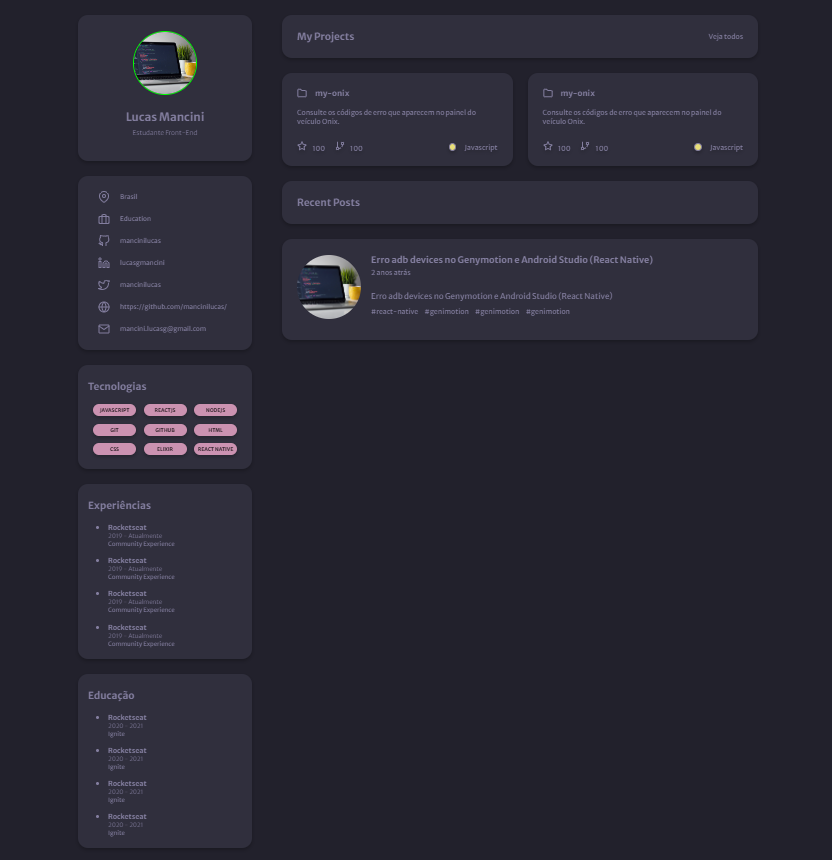

# Desafio Discover - Portfólio

Solução desenvolvida através trilha [Discover - Rocketseat](https://app.rocketseat.com.br/discover/challenges).

## Table of contents

- [Overview](#overview)
  - [The challenge](#the-challenge)
  - [Screenshot](#screenshot)
- [My process](#my-process)
- [Built with](#built-with)

## Overview

### The challenge

Portfólio produzido a partir da proposta e layout disponibilizado pela Rocketseat, trilha Discover. 
O desafio é criar a página responsiva a partir do layout no Figma e tornar a página dinâmica consumindo a API do Github.

### Screenshot

### Links

- Solution URL: [Portfólio Discover]()

## My process

### Built with

- Semantic HTML5 markup
- CSS custom properties
- Flexbox
- Grid
- Figma
- Javascript
